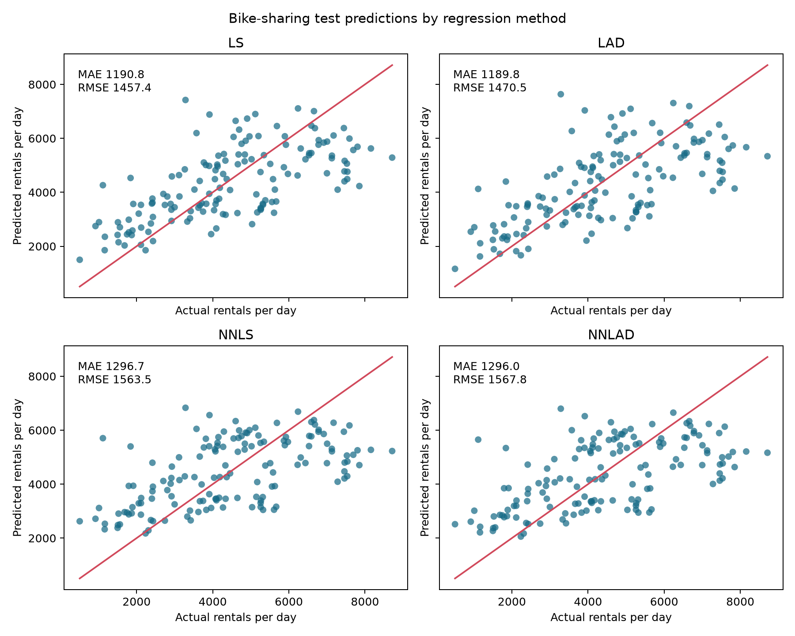

# Regression Methods Report

## 1. Question and experimental design

The question is how well daily bike rentals (`cnt`) can be predicted from normalized temperature (`temp`), humidity (`hum`), and windspeed (`windspeed`). Every model uses

`predicted cnt = b_0 + b_1(temp) + b_2(hum) + b_3(windspeed)`.

The 439-row training split was used to estimate coefficients. The 146-row testing split was held out until model fitting was complete and was used for final evaluation. This is a random-split methods exercise, not a genuine future-demand forecasting design.

## 2. Methods

| Method | What it minimizes | Coefficient constraints | When it may be appropriate |
|---|---|---|---|
| LS | Sum of squared residuals | None | When large errors should receive extra emphasis and errors are reasonably symmetric | 
| LAD | Sum of absolute residuals | None | When robustness to unusually large residuals is useful | 
| NNLS | Sum of squared residuals | `b_1`, `b_2`, `b_3 >= 0`; intercept unrestricted | When predictor effects are required to be nonnegative | 
| NNLAD | Sum of absolute residuals | Same nonnegative slope constraints | When both nonnegative effects and outlier robustness are desired | 

LAD and NNLAD were solved as linear programs using `scipy.optimize.linprog`; NNLS used bounded `scipy.optimize.lsq_linear`. LS used `numpy.linalg.lstsq`. Changing the loss function changes how residual sizes are valued, while coefficient constraints change which parameter values are allowed. These are separate modeling decisions: an LAD fit can still have negative slopes, as seen below.

## 3. Estimated coefficients

| Method | `b_0` | `b_1_temp` | `b_2_hum` | `b_3_windspeed` |
|---|---:|---:|---:|---:|
| LS | 3659.292 | 6694.716 | -2672.608 | -4462.736 |
| LAD | 3762.360 | 7178.510 | -3170.802 | -4853.733 |
| NNLS | 1176.467 | 6659.690 | 0.000 | 0.000 |
| NNLAD | 1041.176 | 6779.134 | 0.000 | 0.000 |

Both unconstrained models estimate a positive temperature association and negative humidity and windspeed associations. The nonnegative constraint moves the latter two slopes to the boundary at zero. This does not prove that humidity or windspeed is irrelevant; it means their conditional associations under this linear specification conflict with the imposed direction. The nearly zero NNLS values were below the numerical tolerance used for reporting.

## 4. Test-set performance

Errors are rentals per day and were calculated from predictions using training-derived coefficients.

| Method | Test MAE | Test RMSE |
|---|---:|---:|
| LS | 1190.8 | 1457.4 |
| LAD | 1189.8 | 1470.5 |
| NNLS | 1296.7 | 1563.5 |
| NNLAD | 1296.0 | 1567.8 |

LAD has the smallest MAE by less than one rental per day relative to LS, while LS has the smallest RMSE. The constrained methods are approximately 106 rentals per day worse on MAE, so the directional constraint has a noticeable predictive cost in this split.

## 5. Graphical evidence

*Figure 1. Actual versus predicted test rentals. The diagonal line indicates exact prediction; the annotations provide MAE and RMSE. The figure shows the similar unconstrained fits and the wider errors from the nonnegative fits beyond the summary tables.*

## 6. Recommended method

I recommend LS for this fixed exercise because it has the lowest test RMSE and its unconstrained signs are plausible as conditional predictive associations in these data. LAD is also defensible when absolute error is the priority, since its MAE is marginally lower. The nonnegative constraint should be selected only if nonnegative effects are substantively required; it is not supported by test performance here. None of these coefficients establishes causation.

## 7. Was validation needed?

Validation was not necessary for fitting these four fixed methods because there were no tuning parameters or predictor choices to select. Using the testing set only after analysis preserves its role as a final evaluation. A validation set would become useful if choosing transformations, predictors, tuning parameters, or a preferred model based on intermediate performance.

## 8. Something interesting

The two robust and non-robust methods make similar directional choices, but the loss function changes the unconstrained slopes noticeably: LAD makes both negative slopes more extreme. Despite that coefficient difference, LS and LAD have nearly identical test MAE, suggesting that their predictions are more similar than their parameter estimates imply. The random split also means this comparison does not assess performance on later calendar dates.

## Reproducibility note

Run `python analyze_regression.py` from the project root. The script reads only `data/training.csv` for fitting and `data/testing.csv` for final metrics, writes `output/submission.csv`, and creates `figures/actual-vs-predicted.png`. It uses NumPy, SciPy HiGHS linear programming via `linprog`, bounded least squares, and Matplotlib. NNLS slopes were approximately `1e-16` or smaller where reported as zero; NNLAD slopes were exactly zero.

